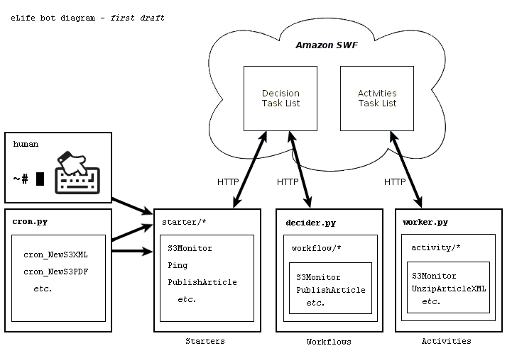
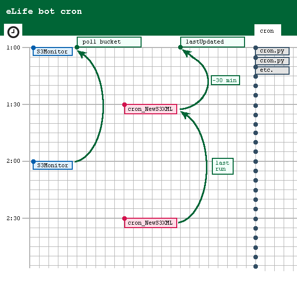

=======
elife-bot Components
=========

## Component diagram

In an effort to explain the components of the elife-bot, a diagram provided as part of the [AWS Flow Framework for Ruby][awsflow] documentation located at Amazon is adapted to illustrate the elife-bot:

[awsflow]: http://docs.aws.amazon.com/amazonswf/latest/awsrbflowguide/awsflow-basics-application-structure.html

In short,

- ``worker.py`` command-line utility polls SWF for activity tasks every 60 seconds, and instantiates an activity class when it receives a task
- ``decider.py`` command-line utility polls SWF for decision tasks every 60 seconds, and instantiates an workflow class when it receives a task
- starters can start one or more workflows
- ``cron.py`` is run every 5 minutes and will load one or more starters when required
- additionally, a human operator can load a starter as required

## A workflow lifecycle example

When eLife bot runs continuously and autonomously, it runs on an hourly schedule. In the first half of each hour it checks for new or updated files, and logs those changes to a DB. In the second half of each hour it will perform actions on those files.

A simple diagram follows to help describe the automated workflows:

Overview:

- An instance cron job executes ``cron.py`` every 5 minutes.
- If it is the top half of the hour (i.e. if the time is 1:00 to 1:29, 2:00 to 2:29, etc.), it will execute ``S3Monitor`` if the last time ``S3Monitor`` was started is more than 31 minutes ago.
- ``S3Monitor`` will poll the S3 bucket for objects and log any object modifications in SimpleDB. The green arrow, in the sample diagram, indicates if ``S3Monitor`` runs at 2:00, it will be aware of files updated since 1:00.
- If it is the bottom half of the hour (i.e. if the time is 1:30 to 1:59, 2:30 to 2:59, etc.), it will execute ``cron_NewS3XML`` if the last time ``cron_NewS3XML`` was started is more than 31 minutes ago (as well as other executions)
- ``cron_NewS3XML``, for example, decides whether it should start any workflows, based on whether it discovers new files were added or changed to the S3 bucket since a lastUpdated date. It calculates the lastUpdated date as the previous time itself was started, minus 30 minutes. The green arrow, in the sample diagram, shows how it calculates it should look at files updated since 1:00.
- Because when ``S3Monitor`` ran at 2:00 it will only have logged objects updated until 2:00, the result will be ``cron_NewS3XML`` will operate on files updated between 1:00 an 2:00

Caveats: A keen reader may wonder what happens if an S3 object is updated while the S3Monitor is running. In short, it still works: objects updated since the S3Monitor has already passed them will get logged in the next hour; objects updated before the S3Monitor reaches them will get logged that hour, due to the atomicity of S3Monitor operations.

Continuing the workflow lifecycle:

- Say that ``cron_NewS3XML`` finds 3 S3 objects were new or updated since 1:00 that contain new article XML
- ``cron_NewS3XML`` will execute multiple starters, as many as are listed in the code to start when new XML is found. Some starters will be given the lastUpdated date, some may not require it.
- Each starter, in turn, will start multiple SWF workflow executions, or a single workflow, depending on what the starter does. For example, 3 new XML objects will result in starting 3 PublishArticle workflows.
- Once a workflow execution is started, the ``decider.py`` and ``worker.py`` processes that are listening on the job queue will process the business logic or activity steps, respectively.
- Each workflow execution will progress as programmed until the workflow execution is COMPLETED, FAILED, or TIMED_OUT (the common status values expected in automated jobs)

Note on time clocks: In comparing the time on an EC2 micro instance and the time used in the SWF queue, the times can differ by more than 60 seconds. Preliminary results from searching the AWS forums indicate there is no approved method to synchronize clocks with the clock used by SWF. When planning cron (scheduled) jobs and calculating time, this greater than 60 second disparity may matter.

## Performance notes

Example running

- on a t1.micro EC2 instance
- 3 decider.py processes in dev environment, 3 in live environment
- 5 worker.py processes in dev environment, 5 in live environment

General performance notes:

- Known to run for weeks uninterrupted between new code deployments
- RAM Mem: 604348k total, 557244k used, after real work performed
- S3Monitor, using a single worker, polls for modifications on 1,700 S3 objects in 4 to 8 minutes
- Unzipping 230 PDF files and saving to S3, approx. 1.4 GB of data, takes 7 minutes
- Publishing 6 articles worth of content (XML, PDF, SVG, eLife lens page, and Fluidinfo API) takes 48 seconds
- Publishing 3 articles to Fluidinfo API takes 12 seconds

